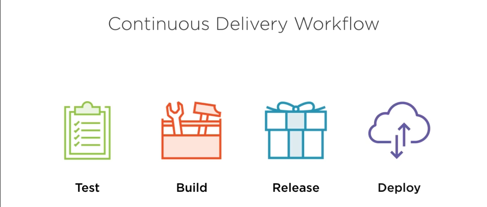
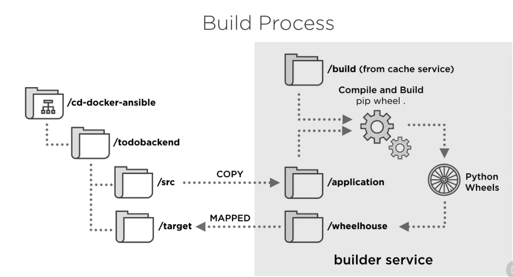
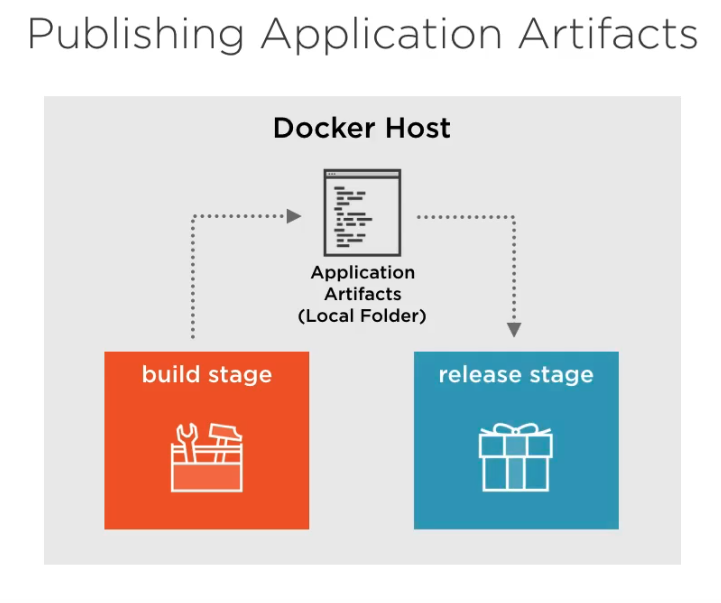

# devops-tutz
# DevOps Learning Initiative #DevOpsInitiative
This project is a part of devops learning initiave to get all related project
search #devOpsInitiative

### Project List 
* [todobackend](https://github.com/abhishek-jaiswal/todobackend) python app the sample application repository, including the continuous delivery workflow
* [acceptance-test](https://github.com/abhishek-jaiswal/acceptance-test) front end acceptance test Node.js test runner that runs acceptance tests against the todobackend sample application
* [docker-ansible](https://github.com/abhishek-jaiswal/docker-ansible) Docker ansible image for agent service. Ansible playbook runner
* [todobackend-base-image](https://github.com/abhishek-jaiswal/todobackend-base-image) Python base image Docker base image of the todobackend development and release images


### Continious Delivery Workflow



### 1. Test
```sh
  # to start with our test part of continuous workflow clone all repo above 
  git clone https://github.com/abhishek-jaiswal/docker-ansible.git
  git clone https://github.com/abhishek-jaiswal/acceptance-test.git
  git clone https://github.com/abhishek-jaiswal/todobackend.git
  git clone https://github.com/abhishek-jaiswal/todobackend-base-image.git
  
  # Build the base image ,
  pushd todobackend-base-image && docker build -t abhishekk/todobackend-base . && popd
  
  # build the Ansible image which will use as a discovery agent
  pushd docker-ansible && docker build -t abhishekk/ansible . && popd
  
  # Build the Development Image
  pushd todobackend/docker/dev/ && docker-compose up agent && docker-compose up test && popd
  
```


### 2. Build

In Build Section we do all the building part of our workflow
```sh
# build the Acceptance test image 
  pushd acceptance-test && docker build -t abhishekk/acceptance-test . && popd
  
  # build the which create all release dependency in python wheels
  docker-compose up builder
  
```



at this point we had build our application atrifacts and published to a local folder that can be consumed by the relased stage as described in below image



### 3. Release
```sh
  pushd todobackend/docker/release/
  
  # clear any exiting build and clean the environment
  docker-compose kill && docker-compose rm -f
  
  # Build The release environment
  docker-compose up agent 
  docker-compose run --rm app manage.py collectstatic --noinput
  docker-compose run --rm app manage.py migrate --noinput
  docker-compose up test 
  popd
  
```

